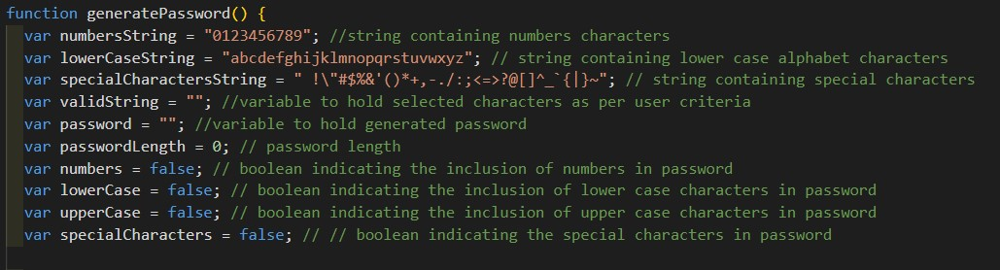
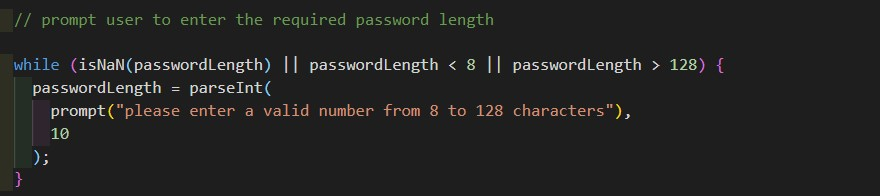
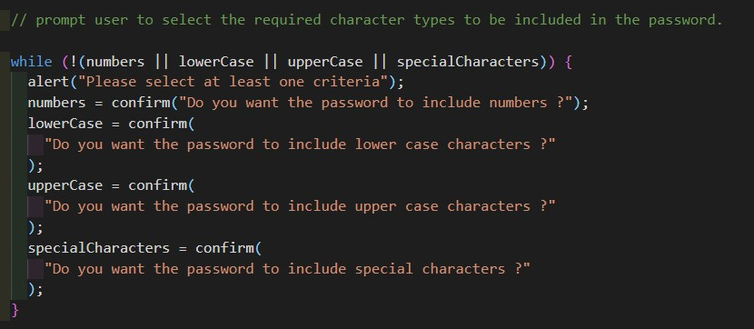
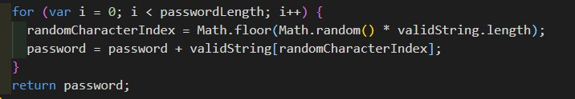

# Password Generator

## Description

This is an app that generates a random password according to the user criteria. The app starts by asking the user to input the required password length. The length needs to be between 8 and 128. The app then asks the user to choose the character groups to include in the password. The user need to select at least one character group from numbers, lower case characters, upper case characters and special characters. The program then generates the password by randomly selecting characters from the selected character groups.

[Click here to the view the deployed website on github-pages](https://mohamedzakigithub.github.io/homework-week3-password-generator/)

## Table of Contents

- [Application logic and code](#Application-logic-and-code)
- [References](#References)

## Application logic and code

### Variables declaration

### Input password length

The app displays a prompt window asking the user to input a valid number between 8 and 128. This will be the required password length and is assigned to the variable passwordLength. The while loop insures that the input value is a valid number and is in the range of 8 and 128. Otherwise the loop will keep prompting the user until a valid input is entered.

### Input character group inclusion criteria.

The app asks the user to select at least one character group to include in the password using a series of confirms. If the user selects a group, the boolean flag for this group will be set to true. The while loop ensures that at least one group is selected by the user by examining the 4 categories flags. if all of them are false, it will keep looping until the user selects at least one category.

### Valid string creation

The app constructs a string containing all the character groups selected by the user by concatenating the selected groups into one string using ternary operation.

### Password generation.

In a for loop with the password length as the iteration times. The app generates a random number in the range of 0 to the last index of the valid string to be used as an index to pick random characters from the valid string and concatenates it to the password string. The function finally returns the password to be displayed to the user. and the app is now ready to generate another password.

### References

[Password Special Characters](https://owasp.org/www-community/password-special-characters)
